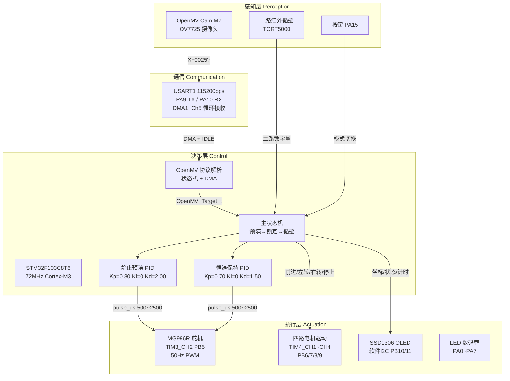
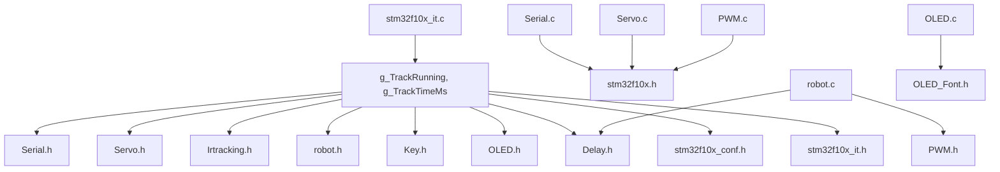
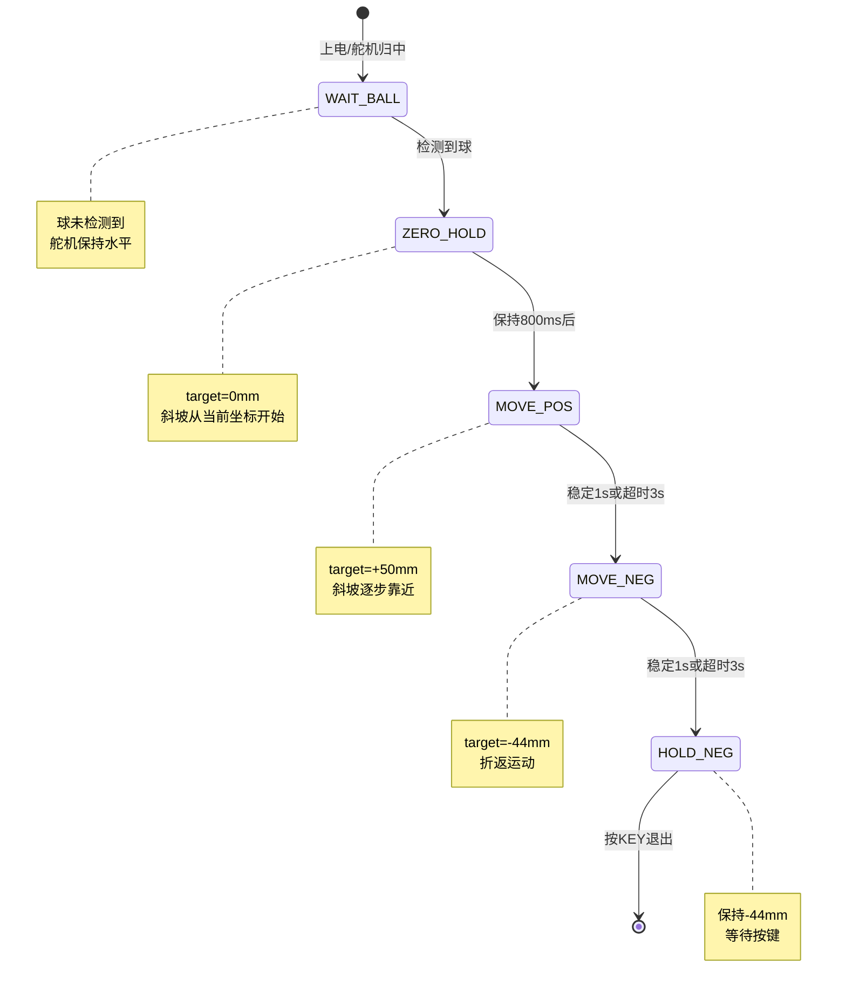

# 2026 全国大学生电子设计竞赛 H 题 —— 车载平衡滚球运动控制系统

基于STM32F103C8T6与OpenMV的双PID管道滚球平衡小车，实现静止位置预演与循迹动态保持功能。


> **参赛学校**：中国海洋大学  
> **参赛院系**：信息科学与工程学部 电子信息工程  
> **参赛年份**：2026   
> **文档版本**： v1.0  
> **最后更新**：2026-08-06 
> **许可证**：MIT License

> 整理出来是对这段时间的一个交代，也希望以后做类似题目的同学能够用得上。

## 项目说明

本项目为2026年全国大学生电子设计竞赛（TI杯）H题省赛参赛作品。
本人独立负责全部STM32端软件开发，包括：基于状态机的 OpenMV 通信协议解析、双 PID 控制器实现与参数整定、系统状态机设计、全车外设驱动与集成调试与系统联调。
OpenMV 视觉算法与机械结构由团队队友完成。

校内测试可完整实现全部功能：静止模式钢球定位误差≤±5mm，循迹模式动态保持误差≤±1cm。
省赛现场受场地光线、机械运输偏移、电池电压不足等因素影响，未完成测试项。代码与文档已开源。

---

## 目录

1. [项目概述](#1-项目概述)
2. [赛题分析](#2-赛题分析)
3. [系统总体架构](#3-系统总体架构)
4. [硬件设计](#4-硬件设计)
5. [软件架构](#5-软件架构)
6. [核心控制方法](#6-核心控制方法)
7. [OpenMV 视觉子系统](#7-openmv-视觉子系统)
8. [串口通信协议](#8-串口通信协议)
9. [开发环境与工具链](#9-开发环境与工具链)
10. [烧录与调试](#10-烧录与调试)
11. [系统工作流程](#11-系统工作流程)
12. [比赛现场复盘](#12-比赛现场复盘)
13. [经验总结与改进方向](#13-经验总结与改进方向)
14. [附录](#14-附录)

---

## 1. 项目概述

### 1.1 项目简介

本项目为 2026 年全国大学生电子设计竞赛（TI杯）H 题——**车载平衡滚球运动控制系统**的完整工程实现。系统由一辆四轮循迹小车作为移动平台，车体上方搭载一根倾斜角度可调的管道，管道内放置一颗钢球。通过 OpenMV 摄像头实时检测钢球在管道内的位置，由 STM32F103C8T6 微控制器运行双 PID 闭环控制算法，驱动 MG996R 舵机调整管道倾斜角，从而实现对钢球位置的精确控制。

### 1.2 核心功能

| 功能模块            | 描述                                                                             |
| ------------------- | -------------------------------------------------------------------------------- |
| **静止预演模式**    | 小车静止，钢球从管道中心 O 出发 → 左移 5cm → 折返右移 5cm → 稳定保持，全自动执行 |
| **循迹保持模式**    | 小车沿黑线循迹行驶，钢球锁定在用户指定的目标位置（误差 ≤±1cm）                   |
| **OpenMV 视觉定位** | 霍夫圆检测 + 卡尔曼滤波，按帧类型分级处理丢失                                    |
| **双 PID 独立调参** | 静止/循迹两套独立参数，共用一套计算函数                                          |
| **目标限速跟踪**    | 目标值大幅切换时自动分解为小步渐进，避免阶跃过冲                                 |
| **OLED 实时显示**   | 0.96 寸 SSD1306 OLED 显示球坐标、状态、计时等关键信息                            |
| **串口 DMA 接收**   | USART1 使用 DMA 接收 OpenMV 数据，不丢帧                                         |

### 1.3 所用硬件与参数

| 指标项       | 参数                                                    |
| ------------ | ------------------------------------------------------- |
| 主控芯片     | STM32F103C8T6 (Cortex-M3, 72MHz, 64KB Flash, 20KB SRAM) |
| 视觉模块     | OpenMV Cam M7 (STM32F765VI, OV7725 摄像头)              |
| 舵机         | MG996R 金属齿轮数字舵机 (4.8~7.2V, 堵转扭矩 ≥9.4kg·cm)  |
| 循迹传感器   | 二路红外对管（TCRT5000 方案）                           |
| OLED 显示    | 0.96 寸 SSD1306, 128×64, I²C 接口                       |
| 电机驱动     | L298N / TB6612 双路 H 桥, TIM4 四路 PWM                 |
| 串口波特率   | 115200bps, 8N1, DMA 接收                                |
| PID 控制周期 | 20ms (50Hz)                                             |
| PWM 舵机频率 | 50Hz (20ms 周期), 脉宽 500~2500μs                       |
| PWM 电机频率 | 20kHz (TIM4, 预分频 36-1, 周期 100-1)                   |
| 系统时钟     | HSE 8MHz → PLL ×9 = 72MHz                               |
| 开发环境     | Keil MDK 5.38 + ARM Compiler V5.06 update 7 (build 960) |
| 固件体积     | 约 12KB (Flash), 约 2KB (SRAM)                          |

---

## 2. 赛题分析

### 2.1 题目原文摘要

> H 题：车载平衡滚球运动控制系统  
> 设计并制作一辆具有管道滚球平衡控制功能的小车。管道一端固定在小车上，另一端由舵机控制倾斜。管道内有一颗钢球。小车上安装摄像头，检测钢球在管道内的位置。通过舵机调整管道倾斜角度，使钢球能按指定要求运动并稳定在目标位置。

### 2.2 任务分解

#### 任务一：静止位置控制

- **条件**：小车静止不动
- **要求**：钢球从管道中心 O（0mm）出发，运动到左侧 5cm 处停下并稳定；折返至右侧 5cm 处停下并稳定
- **评分点**：是否在规定时间内到达目标区域、稳态误差大小、超调量

#### 任务二：运动保持控制

- **条件**：小车沿黑线循迹行驶
- **要求**：钢球稳定在用户在管道上放置的任意位置（误差 ≤ ±1cm）
- **评分点**：循迹速度、球位置误差、是否发生失控/掉球

### 2.3 技术难点分析

| 难点             | 描述                                                                           | 解决思路                                         |
| ---------------- | ------------------------------------------------------------------------------ | ------------------------------------------------ |
| **调整小球位置** | 球位置不可直接控制，只能通过管道倾角间接影响。球在管道内的运动天然存在相位滞后 | 位置环 PD + 目标限速                             |
| **车体运动状态** | 小车加减速、转向时的惯性力会严重干扰球的位置，球可能被甩出视野                 | 独立循迹 PID 参数 + 丢失恢复策略                 |
| **视觉检测延迟** | OpenMV 帧率 ~30fps，检测+传输延迟约 50ms，叠加控制周期 20ms 形成 ~70ms 总延迟  | 容忍延迟的 PID 参数整定                          |
| **非线性和死区** | 舵机传动间隙、管道摩擦、球滚动阻力均为非线性项                                 | 适当调大 P 项，积分项限幅防饱和                  |
| **丢失处理**     | 球经常滚出 OpenMV 视野（管道两端 ±5cm 处），视觉信号丢失后不能盲目控制         | 按丢帧阶段分级处理（有坐标 / 有方向 / 完全丢失） |
| **环境光照敏感** | OpenMV 圆检测对光照变化敏感，不同场地可能阈值完全失效                          | 现场快速标定霍夫圆阈值                           |
| **循迹鲁棒性**   | 二路红外循迹对场地光线、黑色胶带反射率变化敏感                                 | 比赛后建议升级为五路灰度阵列                     |

---

## 3. 系统总体架构

### 3.1 系统框图



### 3.2 引脚资源总表

| 外设      | GPIO    | 复用功能 | 配置         | 说明                       |
| --------- | ------- | -------- | ------------ | -------------------------- |
| USART1 TX | PA9     | AF_PP    | 推挽复用输出 | OpenMV 串口发送            |
| USART1 RX | PA10    | IPU      | 上拉输入     | OpenMV 串口接收 (DMA1_Ch5) |
| TIM3_CH2  | PB5     | AF_PP    | 部分重映射   | 舵机 PWM, 50Hz             |
| TIM4_CH1  | PB6     | AF_PP    | 复用推挽     | 电机左轮PWM1               |
| TIM4_CH2  | PB7     | AF_PP    | 复用推挽     | 电机左轮PWM2               |
| TIM4_CH3  | PB8     | AF_PP    | 复用推挽     | 电机右轮PWM1               |
| TIM4_CH4  | PB9     | AF_PP    | 复用推挽     | 电机右轮PWM2               |
| OLED SCL  | PB10    | Out_OD   | 开漏输出     | 软件模拟 I²C 时钟          |
| OLED SDA  | PB11    | Out_OD   | 开漏输出     | 软件模拟 I²C 数据          |
| 红外左    | PB12    | IPU      | 上拉输入     | 左路循迹传感器             |
| 红外右    | PB13    | IPU      | 上拉输入     | 右路循迹传感器             |
| 按键      | PA15    | IPU      | 上拉输入     | 模式切换按键               |
| LEDSEG    | PA0~PA7 | Out_PP   | 推挽输出     | LED 数码管段选             |

### 3.3 定时器资源分配

| 定时器     | 用途         | 时钟源       | 预分频 | 周期    | 频率            |
| ---------- | ------------ | ------------ | ------ | ------- | --------------- |
| TIM2       | 循迹计时基准 | APB1 (72MHz) | 7200-1 | 10-1    | 1kHz → 1ms 中断 |
| TIM3_CH2   | 舵机 PWM     | APB1 (72MHz) | 72-1   | 20000-1 | 50Hz (20ms)     |
| TIM4_CH1~4 | 电机 PWM     | APB1 (72MHz) | 36-1   | 100-1   | 20kHz           |
| SysTick    | Delay 延时   | HCLK (72MHz) | —      | 72×N    | N μs 延时       |

### 3.4 中断向量表

| 中断源     | IRQ 通道 | 抢占优先级 | 响应优先级 | 功能                           |
| ---------- | -------- | ---------- | ---------- | ------------------------------ |
| TIM2_IRQ   | 28       | 1          | 1          | 1ms 计时累加 g_TrackTimeMs     |
| USART1_IRQ | 37       | 1          | 1          | 串口空闲中断，检测一帧接收完成 |

> **NVIC 分组**：`NVIC_PriorityGroup_2`（2 位抢占优先级 + 2 位响应优先级）

---

## 4. 硬件设计

### 4.1 主控模块

**芯片选型**：STM32F103C8T6

**选型理由**：
- Cortex-M3 内核，72MHz 主频，整数运算性能充足（无 FPU，本工程全部使用定点整数 PID）
- 64KB Flash / 20KB SRAM，固件 ~12KB，余量充裕
- 丰富的外设：4 个通用定时器、3 个 USART、2 路 SPI、2 路 I²C、DMA 7 通道
- 成本低、资料多、生态成熟，适合竞赛快速开发
- LQFP48 封装，手工焊接可行性好

**时钟树配置**：
```
HSE (8MHz 外部晶振)
  └── PLL (×9) → 72MHz SYSCLK
        ├── AHB  (HCLK)  = 72MHz
        ├── APB1 (PCLK1) = 36MHz (最大, TIM2/3/4 定时器时钟 = 72MHz)
        └── APB2 (PCLK2) = 72MHz (USART1, GPIO)
```

### 4.2 OpenMV 视觉模块

**模块型号**：OpenMV Cam M7

**核心参数**：
- 处理器：STM32F765VI (Cortex-M7, 216MHz)
- 摄像头：OV7725, 最大分辨率 640×480
- 本工程使用：QVGA (320×240), GRAYSCALE 灰度模式
- 检测算法：霍夫圆变换 (`find_circles`)，配合卡尔曼滤波
- 检测帧率：约 30fps
- 固件：MicroPython (OpenMV IDE)

**安装位置**：固定在小车上方，俯视管道。摄像头光轴与管道平行。

**标定关系**：
- 像素到毫米的转换系数 `mm_per_pixel` 需实际测量
- 默认参考值：0.675 mm/pixel（QVGA 分辨率，管道长度 162mm 映射到 240 像素）
- 图像垂直方向对应管道长度方向

### 4.3 舵机模块

**型号**：MG996R 金属齿轮数字舵机

**关键参数**：
| 参数            | 值                             |
| --------------- | ------------------------------ |
| 工作电压        | 4.8V ~ 7.2V                    |
| 堵转扭矩 (4.8V) | ≥9.4 kg·cm                     |
| 堵转扭矩 (6.0V) | ≥11 kg·cm                      |
| 响应速度 (4.8V) | 0.19 sec/60°                   |
| 响应速度 (6.0V) | 0.15 sec/60°                   |
| 控制方式        | PWM 50Hz, 脉宽 500~2500μs      |
| 角度范围        | 0°~180°（标称）/ 部分可达 270° |
| 死区宽度        | ≤4μs                           |

**PWM 到角度映射**：
$$\mathrm{pulse\_us} = 500 + \frac{\mathrm{angle}}{180} \times 2000$$

| 角度 | 脉宽   | 说明             |
| ---- | ------ | ---------------- |
| 0°   | 500μs  | 左极限           |
| 45°  | 1000μs | —                |
| 90°  | 1500μs | 中位（管道水平） |
| 135° | 2000μs | —                |
| 180° | 2500μs | 右极限           |

**安全限幅**：
由实际物理结构限制，舵机的最大偏角被钳位在 ±20°，对应脉宽变化量约 ±222μs。
```c
#define SERVO_PULSE_MIN_US  500U   // 硬下限
#define SERVO_PULSE_MAX_US  2500U  // 硬上限
#define SERVO_SAFE_ANGLE_DEG 20    // PID 增量最大偏角 ±20°
// SERVO_SAFE_PULSE_DELTA_US = (20 * 2000) / 180 ≈ 222μs
```

PID 输出的脉宽变化量 delta 被钳位在 `±SERVO_SAFE_PULSE_DELTA_US`，防止极端误差下舵机瞬间满量程打满。

### 4.4 电机驱动

**驱动方案**：L298N

**控制方式**：TIM4 四路 PWM，PWM1 模式，20kHz 频率（超出人耳听觉范围）
- CH1 (PB6): 左轮正转 PWM
- CH2 (PB7): 左轮反转 PWM
- CH3 (PB8): 右轮正转 PWM
- CH4 (PB9): 右轮反转 PWM

**PWM 参数**：
- 预分频：36-1 → 定时器时钟 = 72MHz / 36 = 2MHz
- 周期：100-1 → PWM 频率 = 2MHz / 100 = 20kHz
- 占空比分辨率：100 级（0~100），对应 0%~100%

**运动控制接口**（`robot.c`）：
| 函数                               | 行为                 | 速度范围 |
| ---------------------------------- | -------------------- | -------- |
| `makerobo_run(speed, time)`        | 前进                 | 0~100    |
| `makerobo_Left(speed, time)`       | 右轮转/左轮停 → 左转 | 0~100    |
| `makerobo_Right(speed, time)`      | 左轮转/右轮停 → 右转 | 0~100    |
| `makerobo_Spin_Left(speed, time)`  | 原地左转（差速反向） | 0~100    |
| `makerobo_Spin_Right(speed, time)` | 原地右转（差速反向） | 0~100    |
| `makerobo_brake(time)`             | 刹车（四路 PWM=0）   | —        |

### 4.5 循迹传感器

**方案**：二路 TCRT5000 红外反射式光电传感器

**工作原理**：
- 红外 LED 发射 950nm 红外光
- 光敏三极管接收地面反射光
- 黑线（黑色胶带）吸收红外光 → 反射弱 → 输出高电平（1）
- 白底（场地底板）反射红外光 → 反射强 → 输出低电平（0）

**引脚配置**：
- 左路：PB13, 上拉输入（IPU）
- 右路：PB12, 上拉输入（IPU）

**循迹逻辑**（`Robot_Traction()`）：

| 左 (PB13) | 右 (PB12) | 状态判断                        | 动作             |
| --------- | --------- | ------------------------------- | ---------------- |
| 0         | 0         | 都在白底 → 偏航，需要修正       | 前进             |
| 1         | 0         | 左压黑线 → 偏右                 | 左转             |
| 0         | 1         | 右压黑线 → 偏左                 | 右转             |
| 1         | 1         | 都在黑线上 → 可能是停止线或十字 | 见下方停止线逻辑 |

**停止线检测**：
1. 起跑后 350ms 内（`STOP_LINE_ARM_DELAY_MS`），检测到双黑线不触发停止（防起跑线误触发）
2. 350ms 后进入"武装"状态
3. 检测到持续双黑线 ≥5ms（`STOP_LINE_CONFIRM_MS`），确认到达终点
4. 刹车 + 舵机回中位

### 4.6 OLED 显示模块

| 参数     | 值                              |
| -------- | ------------------------------- |
| 驱动芯片 | SSD1306                         |
| 分辨率   | 128×64                          |
| 接口     | I²C (软件模拟), 地址 0x78       |
| SCL      | PB10 (开漏输出)                 |
| SDA      | PB11 (开漏输出)                 |
| 字符大小 | 8×16 (F8x16 字体), 4 行 × 16 列 |

**显示布局**：
- 预演模式：第 1 行显示球坐标 "X:+050"（mm），第 2 行显示状态 "ST:normal"
- 循迹模式：第 1 行 "Time:" + 计时器，第 2 行球坐标

为了方便调试OpenMV视觉模块，OLED还会显示OpenMV发送的原始坐标数据和状态码。这一功能在比赛中可选关闭，以减少OLED刷新频率和干扰。

经验：在处理类似的视觉控制任务时，使用OLED或其他显示模块进行实时调试和状态监控，这样可以快速定位问题并调整参数。

---

## 5. 软件架构

### 5.1 工程文件结构

```
Code/
├── User/                       # 用户层代码
│   ├── main.c                  # 主程序：全局状态机、双PID控制、OLED界面
│   ├── stm32f10x_it.c          # 中断服务程序：TIM2_IRQ
│   ├── stm32f10x_it.h          # 中断头文件
│   ├── stm32f10x_conf.h        # 标准外设库配置头文件
├── Hardware/                   # 外设驱动层
│   ├── Serial.c / .h           # USART1 DMA接收 + OpenMV ASCII协议解析机
│   ├── Servo.c / .h            # MG996R舵机 TIM3 PWM驱动
│   ├── Irtracking.c / .h       # 二路红外循迹传感器
│   ├── robot.c / .h            # 四轮差速运动控制
│   ├── PWM.c / .h              # TIM4 四路电机PWM初始化
│   ├── Key.c / .h              # 按键消抖与状态读取
│   ├── OLED.c / .h             # SSD1306 OLED 软件I2C驱动
│   ├── OLED_Font.h             # 8x16 ASCII字库
│   ├── LEDSEG.c / .h           # LED数码管驱动（未在比赛中实际使用）
│   ├── Incontrol.c / .h        # 红外遥控驱动（未在比赛中实际使用）
│   ├── Irobstacle.c / .h       # 红外避障驱动（未在比赛中实际使用）
├── Library/                    # STM32F10x 标准外设库 V3.5.0
│   ├── stm32f10x_*.c / .h      # GPIO, TIM, USART, DMA, RCC, NVIC 等
│   └── misc.c / .h             # NVIC 配置辅助函数
├── Start/                      # 启动文件
│   ├── startup_stm32f10x_md.s  # 中等容量启动文件（STM32F103C8）
│   ├── core_cm3.c / .h         # Cortex-M3 内核访问层
│   └── system_stm32f10x.c / .h # 系统时钟初始化
├── System/                     # 系统工具
│   └── Delay.c / .h            # SysTick 微秒/毫秒/秒延时
├── OpenMV/                     # OpenMV 视觉代码（队友编写）
│   ├── main.py                 # 霍夫圆检测 + 卡尔曼滤波 + 串口发送
│   └── README.md               # OpenMV 使用说明
├── Objects/                    # 编译输出（.hex, .axf, .o 等）
├── Listings/                   # 编译清单文件（.map, .lst 等）
├── DebugConfig/                # Keil 调试配置
├── Project.uvprojx             # Keil MDK 5 项目文件
├── Project.uvoptx              # Keil 项目选项文件
├── keilkill.bat                # 清理编译中间文件脚本
├── README.md                   # 本文件
├── LICENSE                     # MIT License
└── .gitignore                  # Git 忽略规则
```

### 5.2 模块关系



### 5.3 全局变量与状态标志

| 变量                         | 类型                       | 作用域        | 用途                                    |
| ---------------------------- | -------------------------- | ------------- | --------------------------------------- |
| `g_TrackRunning`             | `volatile uint8_t`         | main.c & it.c | 循迹计时使能标志（1=计时中）            |
| `g_TrackTimeMs`              | `volatile uint32_t`        | main.c & it.c | 1ms 精度循迹计时器（毫秒）              |
| `g_StopLineArmed`            | `static uint8_t`           | main.c        | 停止线检测武装标志（起跑 350ms 后置位） |
| `g_StopLineCandidateStartMs` | `static uint32_t`          | main.c        | 停止线候选开始时刻                      |
| `g_SerialRxDmaBuffer[128]`   | `static uint8_t`           | Serial.c      | DMA 接收缓冲区                          |
| `g_SerialRxDmaLastPos`       | `static volatile uint16_t` | Serial.c      | DMA 缓冲区已处理到的位置                |
| `g_SerialIdleFlag`           | `static volatile uint8_t`  | Serial.c      | USART1 IDLE 中断标志                    |
| `g_OpenMVTarget`             | `static volatile` struct   | Serial.c      | 解析后的 OpenMV 目标状态                |
| `g_OpenMVParseState`         | `static` enum              | Serial.c      | 协议解析状态机当前状态                  |
| `g_ServoPulseUs`             | `static uint16_t`          | Servo.c       | 当前舵机脉宽（微秒）                    |

### 5.4 主程序结构 (`main.c`)

主程序采用**顺序状态机 + 阻塞式 Delay** 的风格（裸机编程，无 RTOS）：

```
main()
 ├── NVIC_PriorityGroupConfig(NVIC_PriorityGroup_2)
 ├── 外设初始化:
 │   ├── Key_Init()        // PA15 按键
 │   ├── Irtracking_Init()  // PB12/13 红外循迹
 │   ├── LEDSEG_Init()      // PA0~PA7 数码管（该题未使用）
 │   ├── robot_Init()       // → PWM_Init() TIM4 电机
 │   ├── Servo_Init()       // TIM3_CH2 PB5 舵机
 │   ├── Serial_Init()      // USART1 DMA 接收
 │   ├── OLED_Init()        // SSD1306 软件 I²C
 │   └── TIM2_TimeBaseInit()// 1ms 计时基准
 │
 ├── TrackBall_Init(&track_ball) // 初始化循迹球控数据结构
 │
 ├── 阶段 1: StaticPreview_RunUntilStart()
 │   └── 循环: 等待按键 → 执行预演序列（0→+50→-44mm）
 │       ├── Serial_Task()               // 处理 DMA 接收
 │       ├── Preview_UpdateMeasurement()  // 更新球位置
 │       ├── Preview_UpdateTarget()       // 目标限速 + 阶段切换
 │       ├── Preview_ApplyControl()       // PID 计算 → 舵机输出
 │       └── Preview_ShowOLED()           // OLED 刷新
 │
 ├── 阶段 2: 等待用户放球并确认位置
 │   └── 循环: OLED 显示球坐标 → 等待按键
 │
 ├── 阶段 3: 锁定目标位置、重置计时器
 │   └── track_ball.target_mm = measured_mm
 │
 └── 阶段 4: 循迹主循环（无限循环）
     └── while(1)
         ├── Serial_Task()                // DMA 接收处理
         └── if (g_TrackRunning)
             ├── Preview_UpdateMeasurement()  // 更新球位置
             ├── TrackBall_ApplyControl()     // 循迹 PID → 舵机
             ├── Robot_Traction()             // 红外循迹 → 电机
             └── OLED_ShowTimeValue()         // 计时显示
```

### 5.5 中断服务程序 (`stm32f10x_it.c`)

#### TIM2_IRQHandler

```c
void TIM2_IRQHandler(void)
{
    if (TIM_GetITStatus(TIM2, TIM_IT_Update) != RESET)
    {
        TIM_ClearITPendingBit(TIM2, TIM_IT_Update);
        if (g_TrackRunning)      // 仅在循迹阶段累加
        {
            g_TrackTimeMs++;     // 1ms 分辨率计时
        }
    }
}
```

**设计考量**：
- 仅在 `g_TrackRunning==1` 时累加，预演阶段不计时
- 1ms 中断频率对 72MHz MCU 负载低
- `g_TrackTimeMs` 为 `volatile uint32_t`，主循环读取无需关中断

### 5.6 外设驱动模块

#### 5.6.1 Serial.c —— 串口 DMA 接收与协议解析

**核心设计**：DMA 把收到的字节自动写入循环缓冲区（128 字节），串口空闲中断在每帧结束时触发通知。主循环每 20ms 消费一次缓冲区中积累的字节，逐个送入状态机解析。

**DMA 配置**：
| 参数       | 值                           |
| ---------- | ---------------------------- |
| DMA 通道   | DMA1_Channel5 (USART1_RX)    |
| 传输方向   | 外设 → 内存                  |
| 缓冲区大小 | 128 字节                     |
| 模式       | 循环模式 (Circular)          |
| 外设地址   | `&USART1->DR` (固定)         |
| 内存地址   | `g_SerialRxDmaBuffer` (自增) |
| 数据宽度   | 8bit                         |
| 优先级     | 高 (High)                    |

**空闲中断**：
```c
void USART1_IRQHandler(void)
{
    if (USART_GetITStatus(USART1, USART_IT_IDLE) != RESET)
    {
        volatile uint32_t temp;
        temp = USART1->SR;    // 清除 IDLE 标志
        temp = USART1->DR;    // 读取最后一个字节
        (void)temp;
        g_SerialIdleFlag = 1;
    }
}
```

> 踩坑记录：空闲中断里必须先读 SR 再读 DR。顺序反了下一个中断就不会触发，DMA 缓冲区的数据永远处理不了。datasheet 翻了好几遍才发现。

**帧处理机制**：
- `Serial_Task()` 在主循环中被周期性调用（每个控制周期，即 20ms）
- 比较 `DMA_GetCurrDataCounter()` 计算 DMA 已写入位置
- 从上次处理位置到当前位置之间的所有字节逐一送入 `Serial_ProcessByte()`
- 支持多帧堆积处理——如果控制周期跨越了多个 OpenMV 帧，会一次性消费所有缓冲数据

调试时先用 CH340 USB-TTL 模块监看 STM32 TX 的日志输出，确认串口通信正常。然后可以断开 OpenMV，在串口助手里手动发送 `X+0025\r\n` 等帧，看 STM32 OLED 上的坐标和状态是否跟着变化——这是验证解析器最直接的方法，不需要反复用实际的球去试。确认解析正常后再连 OpenMV 实物。

**协议解析状态机**：见 [第 8 章 串口通信协议](#8-串口通信协议)。

**解析结果输出**：
```c
typedef struct {
    int16_t distance_mm;      // 球偏移距离 (mm)，绝对值
    int8_t  direction;        // 方向: +1=左侧(正), -1=右侧(负)
    OpenMV_TargetState_t state; // 解析状态 (NORMAL/SHORT_LOST/DIRECTION_LOST/EMPTY_LOST/INVALID)
    uint8_t valid;            // 本次数据是否有效
    uint8_t exact;            // 是否精确坐标(非LOST)
    uint32_t frame_count;     // 累计接收帧数
} OpenMV_Target_t;
```


`OpenMV_GetTarget()` 使用 `__disable_irq()` / `__enable_irq()` 保护临界区，确保目标结构体的原子读取，防止主循环读到半更新的数据。


当 RX 疑似死机但 TX 心跳正常时，Serial.c 支持通过 IRQ 计数器 + 轮询回退 + ORE 错误计数器等方式输出 `USART1_DIAG|irq|poll|err|last` 格式的诊断信息，快速区分接线问题与 NVIC/ISR 路径问题。

#### 5.6.2 Servo.c —— 舵机 PWM 驱动

**定时器配置**（TIM3_CH2, PB5 部分重映射）：
- 定时器时钟：72MHz（APB1×2, 因 APB1 预分频 ≠ 1）
- 预分频：72-1 → 1MHz (1μs/tick)
- 周期：20000-1 → 20ms (50Hz)
- 输出模式：PWM1, 高电平有效
- 预装载：启用（`TIM_OC2PreloadConfig` + `TIM_ARRPreloadConfig`），防止更新时产生不完整脉冲

**脉冲安全机制**：
- `Servo_SetPulseUs()` 内置硬限幅 (500~2500μs)
- PID 输出额外受 `SERVO_SAFE_PULSE_DELTA_US` 限制（±222μs, 对应 ±20°）

#### 5.6.3 robot.c —— 电机运动控制

**PWM 参数**（TIM4）：
- 预分频：36-1 → 2MHz
- 周期：100-1 → 20kHz（超出人耳听觉范围，无噪音）
- 占空比：0~100 对应 0%~100% 占空比

**控制逻辑**：
- 前进：左右两轮同速正转 (`speed, 0, speed, 0`)
- 左转：右轮转、左轮停 (`0, 0, speed, 0`)
- 右转：左轮转、右轮停 (`speed, 0, 0, 0`)
- 刹车：四路 PWM 全部置 0

**循迹速度**：
```c
#define TRACK_SPEED       56   // 直线行驶占空比 56%
#define TRACK_TURN_SPEED  56   // 转弯占空比 56%
```
速度选择 56% 是在多次测试中平衡了速度与稳定性的折中值，太快则转弯时球容易飞出去，太慢则比赛用时过长。

#### 5.6.4 OLED.c —— 软件模拟 I²C OLED 驱动

**实现特点**：
- 纯 GPIO 位带操作软件模拟 I²C，无需硬件 I²C 外设
- 开漏输出（`GPIO_Mode_Out_OD`），配合外部上拉电阻
- 不检测 ACK 应答（`OLED_I2C_SendByte()` 中额外时钟但不读 SDA），简化时序
- 8×16 ASCII 字库存储在 `OLED_Font.h`（Flash 中，不占 RAM）
- 支持正数、负数、十六进制显示

#### 5.6.5 未使用模块说明

以下模块已初始化但未在当前比赛代码中使用：
- **LEDSEG**（数码管）：`LEDSEG_Init()` 被调用但无后续显示调用，保留以备快速调试
- **Irobstacle**（红外避障）：完整驱动已完成，可用于防撞保护

在比赛中，我们使用数码管来显示一些调试信息，例如球的位置和状态码，这样可以在比赛中快速判断系统的运行状态。虽然在最终比赛中没有使用数码管，但在开发和调试阶段，它是一个非常有用的工具。

在比赛初期，测试场地还没有完全搭建好，我们使用红外避障模块来防止在测试小球的平衡任务时，出现小车撞到障碍物的情况。

这些模块仅在测试中使用，在`main.c`中相关的调用已经完全删去。

---

## 6. 核心控制方法

### 6.1 系统数学模型

#### 6.1.1 球在倾斜管道上的模型

设管道倾角为 $\theta$（以水平为基准），球质量为 $m$，球半径为 $r$，管道对球的摩擦系数为 $\mu$。

球沿管道的加速度可近似为（纯滑动）：
$$a = g \cdot \sin\theta - \mu g \cdot \cos\theta \cdot \mathrm{sgn}(v)$$

当 $\theta$ 较小（≤20°）时，$\sin\theta \approx \theta$，$\cos\theta \approx 1$：
$$a \approx g\theta - \mu g \cdot \mathrm{sgn}(v)$$

以上是纯滑动假设。实际上钢球在管道内是**纯滚动**，转动惯量 $J = \frac{2}{5}mr^2$（实心球），等效质量为 $m_{\mathrm{eff}} = m + J/r^2 = \frac{7}{5}m$，加速度变为：

$$a = \frac{5}{7} g \theta - \mu^{\prime} g \cdot \mathrm{sgn}(v)$$

这是一个**二阶积分系统**——舵机角度（≈θ）到球位置（x）的传递函数为：

$$G(s) = \frac{X(s)}{\Theta(s)} \approx \frac{5g}{7s^2}$$

> $\frac{5}{7}$ 这个系数在实践中不影响 PID 调试——后面的机械传动系数 $K_{\mathrm{mech}}$ 也不确定，两个未知常数的乘积最终被 PID 增益吸收。写出来主要是为了模型完整。

该系统具有：
- **双积分特性**：没有自稳定性，必须闭环控制
- **相位滞后 180°**：对 PD 控制的 D 项要求较高
- **摩擦死区**：微小角度变化不会引起球运动，表现为输入端死区非线性

#### 6.1.2 舵机到管道倾角的传动关系

舵机脉冲 $p$（μs）到管道倾角 $\theta$（°）的映射取决于机械连杆设计：
$$\theta = f(p) \approx K_{\mathrm{mech}} \times (p - 1500)$$

其中 $K_{\mathrm{mech}}$ 为机械传动系数，由连杆长度、支点位置决定。本系统中 $K_{\mathrm{mech}}$ 未精确标定，由 PID 参数隐式吸收。

### 6.2 PID 控制器设计

#### 6.2.1 位置式 PD 算法

```c
static void BallControl_ApplyPid(PreviewControl_t *preview,
    int16_t kp, int16_t ki, int16_t kd,
    uint16_t pid_scale, int32_t int_clamp)
{
    // 1. 计算误差
    error = ramp_target_mm - measured_mm;

    // 2. 积分累加与积分限幅
    integral += error;
    integral = CLAMP(integral, -int_clamp, +int_clamp);

    // 3. PID 混合计算（全部使用 int32_t 避免溢出）
    mixed = (int32_t)kp * error
          + (int32_t)ki * integral
          + (int32_t)kd * (error - prev_error);

    // 4. 缩放还原（kp/ki/kd 已预乘 scale）
    delta = mixed / pid_scale;

    // 5. 硬限幅（安全保护，±222μs ≈ ±20°）
    delta = CLAMP(delta, -SERVO_SAFE_PULSE_DELTA_US, +SERVO_SAFE_PULSE_DELTA_US);

    // 6. 计算最终脉宽
    pulse_cmd = SERVO_CENTER_PULSE_US + PREVIEW_SERVO_DIR * delta;
    pulse_cmd = Servo_ClampPulse(pulse_cmd);  // 500~2500μs 硬限幅

    // 7. 输出
    Servo_SetPulseUs(pulse_cmd);
    prev_error = error;
}
```

**为什么用整数而不是浮点**：

STM32F103C8T6 是 Cortex-M3，没有硬件 FPU。用浮点的话编译器会插入软件浮点库，每条浮点指令几微秒，PID 算一轮要十几微秒。把 Kp/Kd 预先乘以 100，全部用 `int32_t` 算，最后除回来——不损失精度，速度快很多。
- 所有 PID 参数（Kp, Ki, Kd）预先乘以 100（`PID_SCALE`）
- 计算公式中 `(kp * error)` 的结果是真实值的 100 倍
- 最终 `mixed / pid_scale` 一步还原

| 模式     | Kp (×100) | Ki (×100) | Kd (×100) | 实际 Kp | 实际 Kd |
| -------- | --------- | --------- | --------- | ------- | ------- |
| 静止预演 | 80        | 0         | 200       | 0.80    | 2.00    |
| 循迹保持 | 70        | 0         | 150       | 0.70    | 1.50    |

> **为什么不使用 Ki**：积分项在球位置控制中容易引起低频振荡。球系统的摩擦死区 + 舵机传动间隙使得积分项容易在死区内持续累积，然后突然释放导致超调。实际测试中发现纯 PD 控制在两套参数下均能稳定工作，因此 Ki=0。

#### 6.2.2 目标限速（Target Rate Limiting）

在调完静止模式的 PD 之后发现一个问题：当目标从 +50mm 切到 -44mm 的瞬间，误差跳到 94mm。PID 的 D 项看到这么大的"速度"，直接给舵机来了个满量程输出，球飞了。

一开始以为是参数问题，调了两天。后来意识到不是参数的问题——94mm 的阶跃误差，哪个 PD 都受不了。软件层面的解决方案很简单：不让目标直接跳变。

**实际遇到的问题**：当目标从 +50mm 突然切换到 -44mm 时，误差瞬间变为 94mm。PID 的 D 项（微分项）计算的是误差变化率：
$$D_\mathrm{output} = K_d \times \frac{\Delta e}{\Delta t}$$

由于目标跳变，$\Delta e = 94\ \mathrm{mm}$，$\Delta t = 20\ \mathrm{ms}$，若 $K_d = 2.0$：
$$D_\mathrm{output} \approx 2.0 \times \frac{94}{0.02} \times \frac{1}{100} \approx 94\ \mathrm{\mu s}$$

但实际微分项计算在单周期内只看到 -94mm 的误差变化，所以：

第 1 周期：`prev_error` 约为 0（+50 目标时已稳定），`new_error = -44 - (球实际在+50) = -94mm`
$$\Delta e = -94 - 0 = -94\ \mathrm{mm}$$
$$D = 200 \times (-94) / 100 = -188\ \mathrm{\mu s}$$

加上 P 项：$P = 80 \times (-94) / 100 = -75\ \mathrm{\mu s}$

合计约 -263 μs，已经超出 `SERVO_SAFE_PULSE_DELTA_US` (±222 μs)。舵机被瞬间推到极限位置，球直接飞出去。

**解决办法**——每次控制周期只让实际跟踪的目标向最终目标靠近 3mm：
```c
// 每个控制周期只让 ramp_target 靠近 target 3mm
if (ramp_target_mm < target_mm) {
    ramp_target_mm += 3;
    if (ramp_target_mm > target_mm) ramp_target_mm = target_mm;
} else if (ramp_target_mm > target_mm) {
    ramp_target_mm -= 3;
    if (ramp_target_mm < target_mm) ramp_target_mm = target_mm;
}
// PID 使用 ramp_target_mm 而非 target_mm 作为参考输入
error = ramp_target_mm - measured_mm;
```

84mm 的阶跃被拆分成 28 个 3mm 小步，每步 20ms，总共 560ms 平滑过渡。PID 在每个周期看到的最大误差变化约为 3mm，微分项输出量级：
$$D_\mathrm{output} \approx 200 \times 3 / 100 = 6\ \mathrm{\mu s}$$

完全在安全范围内，球平稳跟随目标移动。


**总结**：当被控对象跟不上目标切换速度时，限制参考输入的速率比死调 PID 参数更有效。

#### 6.2.3 两套独立 PID 参数

静止预演模式和循迹保持模式的工况差异显著：

| 对比维度 | 静止预演                | 循迹保持                           |
| -------- | ----------------------- | ---------------------------------- |
| 车体状态 | 静止不动                | 前进、左转、右转                   |
| 干扰来源 | 仅球自身惯性 + 管道摩擦 | 车体加速度的惯性力耦合、转弯离心力 |
| 控制目标 | 球主动运动到指定位置    | 球稳定在用户放置的位置             |
| Kp       | 80 (0.80)               | 70 (0.70)                          |
| Kd       | 200 (2.00)              | 150 (1.50)                         |
| 控制策略 | 较大 D 项抑制过冲       | 稍小 D 项避免对车体振动过度反应    |
| 转向影响 | 无                      | 转弯时扰动最大                     |

两套参数共享同一个 `BallControl_ApplyPid()` 通用 PID 计算函数：
```c
static void Preview_ApplyControl(PreviewControl_t *preview) {
    BallControl_ApplyPid(preview, PREVIEW_KP, PREVIEW_KI,
                         PREVIEW_KD, PREVIEW_PID_SCALE, PREVIEW_INT_CLAMP);
}

static void TrackBall_ApplyControl(PreviewControl_t *preview) {
    BallControl_ApplyPid(preview, TRACK_BALL_KP, TRACK_BALL_KI,
                         TRACK_BALL_KD, TRACK_BALL_PID_SCALE, TRACK_BALL_INT_CLAMP);
}
```

### 6.3 丢失恢复策略

球经常跑出 OpenMV 的视野（管道两端 ±5cm 处超出摄像头覆盖范围），需要分情况处理：

| 层级     | OpenMV 帧格式    | OpenMV_TargetState | 处理策略                                       |
| -------- | ---------------- | ------------------ | ---------------------------------------------- |
| 正常     | `X+0025\r\n`     | `NORMAL`           | 正常使用当前坐标                               |
| 短期丢失 | `X-0018LOST\r\n` | `SHORT_LOST`       | OpenMV 给出了预测坐标，直接使用                |
| 方向丢失 | `X+LOST\r\n`     | `DIRECTION_LOST`   | 根据方向推断球在 `±PREVIEW_EDGE_MM`（±45mm）处 |
| 完全丢失 | `lost\r\n`       | `EMPTY_LOST`       | 见下方恢复逻辑                                 |

**STM32 端的进一步处理**（`Preview_UpdateMeasurement()`）：

```
接收到 NORMAL 或 SHORT_LOST 帧
  → 使用实际坐标，重置丢失计时器

接收到 DIRECTION_LOST 帧
  → direction=+1: measured_mm = +45 (左端)
  → direction=-1: measured_mm = -45 (右端)
  → 继续用"推测"位置做 PID 补偿，争取把球拉回来

接收到 EMPTY_LOST 帧（或超时未收到任何有效帧）
  → 启动 1200ms 恢复窗口:
      ├── 1200ms 内: 沿用最后已知坐标继续补偿
      └── 超时后: 舵机回中位，OLED 显示 "none"，停止控制
```

**1200ms 恢复窗口的设计依据**：
- 球在管道内自由滚动的周期约为 1~2 秒（取决于初始速度和摩擦）
- 太短（如 500ms）则球还没滚回来就放弃了控制
- 太长（如 3s）则舵机长时间在错误方向工作，可能把球推得更远
- 1.2s 是在多次测试中取的一个折中值

### 6.4 停止线检测逻辑

```
Robot_Traction() 被 20ms 主循环调用
├── if (g_TrackTimeMs >= 350ms)    → g_StopLineArmed = 1
├── 循迹判断 (left, right)
│   ├── 00 → 前进
│   ├── 10 → 左转
│   ├── 01 → 右转
│   └── 11 → 双黑线检测
│       ├── if (!g_StopLineArmed)  → 前进（忽略起跑线）
│       ├── 首次触发 → 记录候选起始时间
│       └── 持续 ≥5ms  → 刹车 + 返回 1（停止）
```

**防误触发机制**：
1. **时间门限**：起跑后 350ms 内的双黑线被忽略（过起跑线）
2. **持续确认**：需要双黑线状态保持 ≥5ms 才算有效停止线（防瞬时干扰）
3. **武装标志**：`g_StopLineArmed` 确保只有在通过起跑线后才开始检测

### 6.5 方向修正开关

```c
#define PREVIEW_SERVO_DIR 1  // 若控制方向反了，改成 -1
```

这是一个**单行代码解决方向极性**问题的方案。在首次联调时，若发现舵机转动方向与期望相反（球向右跑时舵机应左倾却右倾），只需修改这一个宏定义即可全局纠偏，无需改动 PID 参数或机械结构。

---

## 7. OpenMV 视觉子系统

### 7.1 检测原理

OpenMV Cam M7 使用 **GRAYSCALE 灰度模式** 下的**霍夫圆变换**（`find_circles`）来检测钢球的圆形轮廓。

**处理流程**：
```python
while True:
    img = sensor.snapshot()                        # 采集一帧 320×240 GRAYSCALE
    img.gaussian(1)                                 # 高斯模糊降噪
    img.gamma(gamma=1.0, contrast=1.15)             # 对比度增强
    circles = img.find_circles(                     # 霍夫圆检测
        roi=ROI, threshold=CIRCLE_THRESHOLD,
        r_min=7, r_max=8, r_step=2)
    if circles:
        # 取有效 ROI 内幅度最大的圆
        best = max(valid_circles, key=lambda c: c.magnitude())
        offset_mm = (best.cy() - center_y) * pixel_mm
        filtered_mm = kf.update(offset_mm)           # 卡尔曼滤波
        uart.write("X{}{:04d}\r\n".format(sign, int(abs(filtered_mm))))
    else:
        # 丢失处理 → 卡尔曼预测 → 发送 LOST 帧
```

### 7.2 关键参数

| 参数           | 默认值            | 说明                            |
| -------------- | ----------------- | ------------------------------- |
| 分辨率         | QVGA (320×240)    | 平衡检测精度与帧率              |
| 色彩模式       | GRAYSCALE         | 灰度模式，降低计算量            |
| 霍夫圆阈值     | 2150              | `find_circles` 阈值，需现场微调 |
| 圆半径范围     | 7~8 px            | 钢球在 QVGA 下的像素半径        |
| ROI            | (162, 0, 45, 240) | 管道检测区域                    |
| 物理极限       | ±75mm             | 超出后主动降级为丢失            |
| 最大短期丢失帧 | 100 帧 (~3s)      | 超过后降为中期丢失              |
| 最大中期丢失帧 | 300 帧 (~10s)     | 超过后彻底丢失，全状态重置      |

### 7.3 丢失分级策略（OpenMV 端）

| 连续丢失帧数        | 发送格式                | 含义                       |
| ------------------- | ----------------------- | -------------------------- |
| 1~100 帧            | `X{sign}{:04d}LOST\r\n` | 短期丢失，Kalman 预测坐标  |
| 101~300 帧, 有方向  | `X{sign}LOST\r\n`       | 中期丢失，只知方向不知距离 |
| >300 帧, 或从未检测 | `lost\r\n`              | 彻底丢失，重置全部状态     |

### 7.4 标定注意事项

1. **霍夫圆阈值 `CIRCLE_THRESHOLD`** 是最关键的参数。不同光照环境下检测灵敏度变化显著，现场需要重新微调
2. **mm_per_pixel** 受摄像头安装高度影响，松动后需重新测量
3. **ROI 和物理极限** 依赖于摄像头与管道的相对位置，建议用已知位置的球做多点验证
4. 钢球的像素半径 `R_MIN/R_MAX` 是硬约束——如果钢球在图像中的成像大小与设定不符（如摄像头高度改变），圆检测直接失效

---

## 8. 串口通信协议

### 8.1 物理层

| 参数     | 值                                       |
| -------- | ---------------------------------------- |
| 接口     | USART1 (PA9 TX, PA10 RX)                 |
| 波特率   | 115200 bps                               |
| 数据位   | 8                                        |
| 校验位   | None                                     |
| 停止位   | 1                                        |
| 流控     | None                                     |
| 电平     | 3.3V TTL                                 |
| 连接方式 | 直连（OpenMV P4→PA10, P5→PA9, GND 共地） |

> 调试时可使用 CH340 USB-TTL 模块监听 STM32 TX 的日志输出（需交叉 TX/RX，共地，确保 3.3V 电平兼容）。

### 8.2 数据链路层 —— OpenMV 协议帧

所有帧均为 **ASCII 文本行**，以 `\r\n`（CR+LF, 0x0D 0x0A）结尾。

帧长度固定性：

| 帧格式           | 字节数 | 示例             |
| ---------------- | ------ | ---------------- |
| `X±NNNN\r\n`     | 8      | `X+0025\r\n`     |
| `X±NNNNLOST\r\n` | 12     | `X-0018LOST\r\n` |
| `X±LOST\r\n`     | 8      | `X+LOST\r\n`     |
| `lost\r\n`       | 6      | `lost\r\n`       |

### 8.3 帧类型详解

#### 类型 1：正常跟踪帧

```
格式：X {sign} {digit4} \r \n
说明：球被正常检测到
字段：
  X        - 帧起始标记 (0x58)
  sign     - '+' 表示球在管道左侧（正坐标）, '-' 表示右侧（负坐标）
  digit4   - 4 位零填充十进制数字，表示球距离管道中心的绝对值 (mm)
  范围：0000 ~ 9999

示例：
  X+0000\r\n  → 球在中心
  X+0050\r\n  → 球在左侧 50mm
  X-0034\r\n  → 球在右侧 34mm
```

#### 类型 2：短期丢失帧（带预测坐标）

```
格式：X {sign} {digit4} L O S T \r \n
说明：球短暂丢失（≤100帧），OpenMV 通过卡尔曼滤波器预测坐标
字段：
  sign/digit4 - 同类型1
  LOST       - 丢失标志（逐字符验证，非一次性匹配）

示例：
  X+0025LOST\r\n  → 预测球在左侧 25mm 附近
```

#### 类型 3：方向丢失帧（有方向无距离）

```
格式：X {sign} L O S T \r \n
说明：球丢失时间较长，只知道上一次球在哪个方向
字段：
  sign       - 最后已知方向
  LOST       - 丢失标志

示例：
  X+LOST\r\n     → 球在左侧某处丢失
```

#### 类型 4：彻底丢失帧

```
格式：l o s t \r \n  (全小写)
说明：完全无法检测到球，无任何方向或位置信息
```

#### 类型 5：大写丢失帧（兼容预留）

```
格式：L O S T \r \n  (全大写)
说明：当前 OpenMV 代码只发送小写 `lost`，不大写 `LOST`。
      STM32 解析器同时支持大小写，防止将来固件改动导致不兼容。
```

### 8.4 解析器实现细节

**状态机设计**（`Serial_ProcessByte()`）：

```
状态转移表（共 12 个状态）：

OPENMV_PARSE_WAIT_START (0)
  ├── 收到 'X' → WAIT_SIGN (帧类型1/2/3)
  ├── 收到 'L' → BARE_LOST_UP_O (帧类型5: "LOST")
  ├── 收到 'l' → BARE_LOST_O (帧类型4: "lost")
  └── 其他 → 保持 WAIT_START

OPENMV_PARSE_WAIT_SIGN (1)
  ├── 收到 '+'/'-' → READ_DIGITS (记录方向, 开始读数字)
  ├── 收到 'X'/'l' → ResetAndReplay (容忍帧粘连, 重新开始)
  └── 其他 → ResetParser

OPENMV_PARSE_READ_DIGITS (2)
  ├── 收到 digit → 累加距离 (digitCount++), 最多4位
  ├── 收到 'L' → X_LOST_O (开始 LOST 序列)
  ├── 收到 'X'/'l' → ResetAndReplay (帧粘连恢复)
  └── 其他 → ResetParser

OPENMV_PARSE_X_LOST_O → OPENMV_PARSE_X_LOST_S → OPENMV_PARSE_X_LOST_T
  (逐字符匹配 'O','S','T', 任一字符不匹配则 ResetParser)

OPENMV_PARSE_BARE_LOST_O → OPENMV_PARSE_BARE_LOST_S → OPENMV_PARSE_BARE_LOST_T
  (逐字符匹配 'o','s','t')

OPENMV_PARSE_BARE_LOST_UP_O → ... → OPENMV_PARSE_BARE_LOST_UP_T
  (逐字符匹配 'O','S','T')

所有状态收到 '\n' → 触发 FinalizeFrame, 生成目标结构体
所有状态收到 '\r' → 忽略 (允许 CR 出现在任何位置)
```

**容错能力**：
1. **帧粘连**：若两帧之间没有正确的 `\r\n` 分隔（如 `X+0025\r\nX-0030\r\n` 粘连为 `X+0025X-0030\r\n`），解析器在遇到意外字符时自动回退并用当前字节重新开始解析（`ResetAndReplay` 机制）
2. **中断后的半帧**：热插拔串口或上电瞬间可能收到不完整的帧（如 `+0025\r\n` 缺少起始 `X`），状态机会因不匹配而复位
3. **乱码/噪声**：非预期的字节序列会导致状态机回到 `WAIT_START`，不会卡死
4. **缓冲区溢出保护**：128 字节的 DMA 环形缓冲 + 128 字节的原始数据 FIFO，主循环即使短时间阻塞也不会丢数据

---

## 9. 开发环境与工具链

### 9.1 IDE 与编译器

| 工具                 | 版本                       | 用途                                     |
| -------------------- | -------------------------- | ---------------------------------------- |
| Keil MDK 5 (μVision) | 5.38                       | IDE, 项目管理, 代码编辑                  |
| ARM Compiler (ARMCC) | V5.06 update 7 (build 960) | C 编译器                                 |
| STM32F1xx DFP        | 2.4.1                      | 芯片支持包 (CMSIS, 启动文件, Flash 算法) |
| ST-LINK Utility      | —                          | 烧录验证, Flash 读写                     |
| OpenMV IDE           | 最新版                     | OpenMV Python 代码编辑与烧录             |

### 9.2 编译选项

```
优化等级: -O2 (高优化, 平衡代码大小与速度)
C99 标准
--gnu (GNU C 扩展)
调试信息: 生成
HEX 文件: 生成 (Intel HEX 格式)
```

### 9.3 库文件

- **STM32F10x Standard Peripherals Library (StdPeriph) V3.5.0**：ST 官方外设驱动库
- **CMSIS Core V3.x**：Cortex-M3 内核访问层
- 未使用 HAL 库（HAL 库体积较大，对 64KB Flash 不友好）

### 9.4 版本控制

```
.gitignore 忽略规则:
  - Objects/ 编译中间文件
  - Listings/ 编译清单
  - *.uvguix.* 用户偏好
  - DebugConfig/ 调试配置
  - *.hex / *.axf / *.bin 可执行文件
  - JLink 日志

保留在 Git 中的：
  - 所有源代码 (.c / .h / .s)
  - 项目文件 (.uvprojx / .uvoptx)
  - README.md / LICENSE
  - OpenMV 代码
```

---

## 10. 烧录与调试

### 10.1 烧录方法

**使用 ST-Link V2（SWD 接口）**：
```
ST-Link V2 引脚         STM32F103C8T6
─────────────────       ────────────────
SWCLK   ───────────────→  PA14 (SWCLK)
SWDIO   ───────────────→  PA13 (SWDIO)
GND     ───────────────→  GND
3.3V    ───────────────→  3.3V (可选, 目标板可自供电)
```

在 Keil 中：
1. `Project → Options for Target → Debug → Use: ST-Link Debugger`
2. `Settings → Port: SW, Max Clock: 4MHz`
3. `Flash → Download → 勾选 Erase Sectors, Program, Verify`
4. `F7` 编译 / `F8` 烧录

### 10.2 串口调试

**CH340 USB-TTL 模块**监听 STM32 的 PA9 (TX) 输出：
```
CH340 引脚              STM32
─────────────────       ────────────────
RX     ───────────────→  PA9  (TX)   ← 交叉
GND    ───────────────→  GND          ← 必须共地
```

串口终端设置：115200bps, 8N1, 无流控

**调试日志**：
```
=== STEP4 STATIC PREVIEW ===             ← 进入预演模式
STEP4 PHASE: BALL DETECTED, START PREVIEW ← 检测到球
STEP4 PHASE: MOVE +50mm                   ← 开始右移
STEP4 PHASE: MOVE -44mm                   ← 开始左移
STEP4 PHASE: HOLD -44mm                   ← 稳定保持
STEP4 EXIT: key pressed, enter tracking   ← 进入循迹
USART1_DIAG|irq|poll|err|last            ← 诊断输出（异常时）
```

进行调试时，需要先编写测试程序。该项目目前已不包含测试程序。


---

## 11. 系统工作流程

### 11.1 系统上电启动序列

```
系统上电/复位
│
├─ 1. NVIC 分组配置 (Group2: 2位抢占/2位响应)
│
├─ 2. 外设初始化 (顺序有依赖关系)
│   ├─ Key_Init()         ← GPIO, 无依赖
│   ├─ Irtracking_Init()  ← GPIO, 无依赖
│   ├─ LEDSEG_Init()      ← GPIO, 无依赖
│   ├─ robot_Init()       ← TIM4 + GPIO, 需 RCC
│   ├─ Servo_Init()       ← TIM3 + GPIO, 需 RCC+AFIO
│   ├─ Serial_Init()      ← USART1 + DMA1 + GPIO, 需 RCC
│   ├─ OLED_Init()        ← 软件I2C GPIO
│   └─ TIM2_TimeBaseInit()← TIM2 + NVIC
│
├─ 3. 进入静止预演阶段
│   └─ StaticPreview_RunUntilStart()
│       ├── 舵机归中, 电机刹车
│       ├── 等待 OpenMV 检测到球
│       ├── 自动执行 0→+50→-44mm 位移序列
│       └── 按 KEY → 退出
│
├─ 4. 循迹目标锁定阶段
│   ├── OLED 显示当前球坐标
│   ├── 用户手动放球到期望位置
│   └── 按 KEY → 锁定 target_mm
│
└─ 5. 循迹主循环 (无限)
    └── while(1)
        ├── Serial_Task()           ← DMA 数据处理
        ├── 球控 PID              ← 20ms 周期
        ├── 红外循迹 + 停止线检测 ← 实时响应
        └── OLED 计时更新         ← 每周期刷新
```

### 11.2 静止预演状态机



**阶段切换条件**：
| 阶段      | 目标  | 切换条件                                |
| --------- | ----- | --------------------------------------- |
| WAIT_BALL | 0mm   | 收到有效球位置                          |
| ZERO_HOLD | 0mm   | 保持 ≥800ms                             |
| MOVE_POS  | +50mm | 稳定（误差≤10mm）≥1000ms 或 超时 3000ms |
| MOVE_NEG  | -44mm | 稳定（误差≤10mm）≥1000ms 或 超时 3000ms |
| HOLD_NEG  | -44mm | 等待按键（无时限）                      |

> **注意**：负方向目标设为 -44mm 而非 -50mm。这是因为管道物理左侧的有效行程比右侧短约 6mm（机械限位原因）。代码中的硬编码值需要根据实际机械结构调整。

### 11.3 循迹模式控制时序

```
每个主循环周期 (~20ms)
│
├─ Serial_Task()
│   └── 消费 DMA 缓冲区 → 更新 g_OpenMVTarget
│
├─ Preview_UpdateMeasurement(&track_ball)
│   └── 读取 g_OpenMVTarget → 更新 measured_mm / loss 状态
│
├─ TrackBall_ApplyControl(&track_ball)
│   └── PID 计算 → Servo_SetPulseUs()
│
├─ Robot_Traction()
│   ├── 读取红外传感器
│   ├── 判断方向 → 电机控制
│   └── 停止线检测 → 刹车
│
└─ OLED_ShowTimeValue(g_TrackTimeMs)
    └── 更新计时显示
```

---

## 12. 比赛现场复盘

### 12.1 比赛当天状况

> 写这段其实不太舒服，但有必要。
> 在测试开始之前，我们其实有着很大的自信。但是实际情况远远在我们预期之外。

在实验室环境下，该系统可以完整跑通全部功能：
- 静止预演：钢球平稳完成 0→+50→-44mm 运动，稳态误差可以稳定在 ±5mm 内（OpenMV 摄像头高度较低，管道右侧极限实际只能到 -44mm 而非 -50mm）
- 循迹保持：小车沿黑线行驶，球位置误差在 ±1cm 内

但在 **比赛现场**，三个问题叠加导致一项任务都没能完整跑下来：

### 12.2 问题一：红外循迹阈值

**问题**：在实验室调试好的红外阈值，到比赛现场完全不认黑线。

**分析**：
- 比赛场地使用的照明与实验室场地有差异
- TCRT5000 红外传感器对可见光也有响应
- 二路循迹方案虽然简单，但这个系统十分脆弱，只要有一个传感器误判，小车就会跑偏
- 实验室调试时未进行光照鲁棒性测试
- 不排除由于运输或其他原因，导致接线松动或传感器位置偏移，进一步降低了系统的鲁棒性

**量化分析**：
TCRT5000 在标准白底反射下的输出电压约 0.2V（逻辑低），在黑线上的输出电压约 3.0V（逻辑高）。但在高环境光下，白底的反射光可能使输出电压升高到 1.5V，进入 GPIO 输入阈值的不确定区域（STM32 的 VIH 最小为 2.0V，VIL 最大为 0.8V）。传感器的模拟特性与 GPIO 数字输入的判别产生失配。

### 12.3 问题二：球控发散

**问题**：车一动，球就控制不住，越偏越多直至飞出管道。

**分析**：
- 电池电压下降：比赛现场用的是另一块电池（可能是旧电池或未充满），舵机供电电压偏低
- MG996R 的响应速度与供电电压密切相关——6.0V 时 0.15s/60°，4.8V 时 0.19s/60°
- 实验室内 PID 参数是针对高电压（快响应）整定的，现场舵机变慢 → 实际系统的时间常数变大 → 原有 Kd 偏小 → 相位裕度不足 → 震荡/发散
- 未做电池电压补偿：没有检测电池电压并根据电压动态调整 PID 参数
- 其实在测试的时候，我们也发现了这个问题，但当时没有重视，认为电池电压下降是偶发事件，等到小车电机彻底无法工作时才更换电池

### 12.4 问题三：准备不足

**客观原因**：
- 未带备用电池（电池是比赛消耗品，至少应备 2~3 块满电的）
- 未做电压补偿设计
- 未在不同光照条件下测试循迹阈值（仅在单一实验室光照下调试）
- 未准备物理急停按钮

**根本原因**：
嵌入式系统的"可靠性"不是"在理想条件下能跑通"，而是"在各种非理想条件下都能兜住底"。比赛现场的不可控因素（光照、电源、温湿度）是常态，不是意外。

### 12.5 问题四：小车本身结构设计问题

**问题**：比赛现场小车的机械结构和传感器位置可能发生了微小偏移，导致循迹和球控性能下降。

- 我们设计的小车的物理结构非常脆弱，只用胶带固定传感器和舵机，运输过程中可能发生轻微的震动或碰撞，导致传感器位置偏移。
- 我们的车架非常小，导致在车架上只能放置有限的电源、传感器、主板，所以我们在第一层车架之上又加了第二次车架，增加了车体的高度和重心，使得在运输过程中更容易发生晃动。  
- 第二层车架本身安装位置非常不稳固。在第二层支架上，我们安装了舵机和管道结构，这些结构天然具有不稳定性，大大提高了调PID的难度以及不可靠性。
- 在本身不稳固的第二层车架上，我们又用了不稳固的较长较重的支架架设OpenMV摄像头，这使得摄像头在运输过程中以及小车正常运行时都非常容易发生晃动，导致摄像头的安装位置发生偏移，从而影响球控的精度。
- 受限于小车不稳定的结构，我们在小车上安装了较长的管道结构，这使得小球在运行过程中容易发生晃动，导致球控的精度下降，稳定性下降。
- OpenMV摄像头受限于车架没有办法安装到合适高度，即使高度较低没有办法拍到整个管道，OpenMV摄像头依然晃动非常剧烈，导致系统非常不稳定。
---

## 13. 经验总结与改进方向

### 13.1 软件层面的经验

| 措施             | 效果                        |
| ---------------- | --------------------------- |
| 用整数算 PD      | 无浮点开销，适合 M3 无 FPU  |
| 目标限速         | 解决阶跃响应过冲            |
| DMA + 空闲中断   | CPU 不需要轮询串口          |
| 逐字节解析状态机 | 任何 ASCII 行协议都能用     |
| 分阶段丢失处理   | 覆盖从刚丢到彻底丢所有情况  |
| 方向修正宏       | 改了极性不用动参数          |
| 停止线两段确认   | 防止起跑线误触发 + 瞬时干扰 |
| 两套 PD 分开调   | 不同工况用不同参数          |

### 13.2 下次绝对不能犯的错误

1. **不带备用电池**：电池是比赛的生命线。至少带 3 块满电电池，并标定每块的放电特性
2. **不做光照试验**：在至少 3 种光照条件（暗室/正常/强光）下测试传感器阈值
3. **不做电压补偿**：检测电池电压，对舵机输出做电压前馈补偿（电压低 → 加大 PID 输出幅度）
4. **不设物理急停**：一个急停键可以在球失控时立刻刹住舵机和电机，避免浪费时间重启
5. **不测环境适应性**：实验室测好≠现场能用。尽量模拟比赛现场条件测试
6. **不做机械稳固性**：摄像头、舵机、管道、车架都要稳固，运输过程中不会晃动

### 13.3 技术改进路线

#### 短期改进

1. **五路灰度循迹 + PID 速度闭环**
   - 替换二路红外，使用 5 路灰度传感器阵列（如 TCRT5000 ×5 或 CCD 线性 CCD）
   - 实现位置偏差的比例控制 + 速度 PID 闭环
   - 对比：二路只有 4 种状态（00/01/10/11），五路有 32 种状态，可计算连续偏移量

2. **电池电压检测**
   ```c
   float battery_voltage = ADC_Read() * (3.3/4096) * (15.1/5.1);
   float gain_compensation = 6.0f / battery_voltage;  // 以6V为基准
   kp_compensated = base_kp * gain_compensation;
   kd_compensated = base_kd * gain_compensation;
   ```

3. **物理急停键**
   ```c
   // 在 main loop 中检查急停键
   if (EmergencyStop_Get() == 1) {
       Servo_SetPulseUs(SERVO_CENTER_PULSE_US);
       makerobo_brake(0);
       g_TrackRunning = 0;
       while (EmergencyStop_Get() == 1); // 等待释放
       NVIC_SystemReset();               // 软复位
   }
   ```

#### 中期改进


4. **自适应光照循迹阈值**
   - 上电时自动扫描传感器值，标定当前光照下的白/黑基准
   - 阈值 = (白基准 + 黑基准) / 2，而非硬编码


---

## 14. 附录

### 14.1 PID 参数整定笔记

**静止预演模式调参过程**：

| 轮次 | Kp  | Kd  | 现象                         | 调整             |
| ---- | --- | --- | ---------------------------- | ---------------- |
| 1    | 60  | 100 | 响应太慢，5秒才能到位        | 上调 Kp          |
| 2    | 120 | 100 | 快速到位但过冲严重，多次震荡 | 下调 Kp, 上调 Kd |
| 3    | 80  | 150 | 到位快，但停止前有小幅摆动   | 上调 Kd          |
| 4    | 80  | 200 | 到位时间 ~2s, 稳态误差 ≤5mm  | 采用             |
| 5    | 80  | 250 | 无明显改善，D 项噪声放大     | 回退             |

**循迹保持模式调参过程**：

| 轮次 | Kp  | Kd  | 现象                           | 调整             |
| ---- | --- | --- | ------------------------------ | ---------------- |
| 1    | 80  | 200 | （复用静止参数）转弯时球摆动大 | 下调 Kp, 下调 Kd |
| 2    | 60  | 120 | 太迟钝，球追不上车的运动       | 上调 Kp          |
| 3    | 70  | 150 | 直行稳定，转弯可控             | 采用             |
| 4    | 70  | 180 | 转弯时球有轻微摆动             | 上调 Kd          |

### 14.2 已知 BUG 与限制

| BUG/限制                        | 影响                         | 状态             |
| ------------------------------- | ---------------------------- | ---------------- |
| 快速连续按 KEY 可能导致状态跳过 | 需按键去抖优化               | 已知, 影响小     |
| OLED 显示在高更新率下有闪烁     | 软件 I²C 清屏速度有限        | 已知, 可接受     |
| 未监测 TIM2 溢出                | 计时最大约 49.7 天后溢出     | 已知, 竞赛用无关 |
| OpenMV 串口线松动后恢复需时间   | DMA 可能收到乱码，需几帧恢复 | 解析器有容错     |
| 无看门狗                        | 程序跑飞无法自动复位         | 应加 IWDG        |

### 14.3 如何快速上手

若你拿到了这份代码并希望复现该系统：

1. **硬件准备**：
   - STM32F103C8T6 最小系统板 ×1
   - MG996R 舵机 ×1（需外部 5~6V ≥2A 电源，不可从 STM32 板载 3.3V 取电）
   - 四轮小车底盘 + L298N/TB6612 电机驱动 + 直流电机 ×4（需外部 5~6V ≥2A 电源，也可使用2个直流电机，可以接PB6和PB8）
   - OpenMV Cam M7 ×1
   - 0.96 寸 SSD1306 OLED ×1
   - 二路 TCRT5000 红外循迹模块 ×1

2. **接线**：按 [3.2 节引脚资源总表](#32-引脚资源总表) 连接

3. **软件烧录**：
   - 用 Keil 打开 `Project.uvprojx`
   - 修改 `PREVIEW_TARGET_NEG_MM` 为你机械结构的左极限（机械结构的极限需要通过实际测量自己调整）
   - 编译烧录
   - 将 `OpenMV/main.py` 拷贝到 OpenMV SD 卡，在 IDE 中标定霍夫圆阈值（`CIRCLE_THRESHOLD`）

4. **调试顺序**：
   - 先用串口助手确认 OpenMV 发送了正确的帧格式
   - 断开 OpenMV，用串口助手模拟发送 `X+0025\r\n` 等帧，观察 STM32 OLED 是否正确显示
   - 连接舵机但不放球，模拟发送不同坐标观察舵机反应
   - 放球，逐步调 PID 参数
   - 最后加上循迹

### 14.4 参考资料

- STM32F103x8/xB Datasheet (Doc ID 13587)
- RM0008: STM32F10xxx Reference Manual
- STM32F10x Standard Peripherals Library User Manual (UM0427)
- MG996R Datasheet
- SSD1306 Datasheet
- OpenMV Cam M7 Quick Reference
- TCRT5000 Datasheet
- ARM Cortex-M3 Technical Reference Manual

---

## 致谢

感谢我的两位队友在 OpenMV 视觉算法和机械结构设计上的贡献。

感谢中国海洋大学（西海岸校区）信息科学与工程学部提供的实验室和测试场地。

这是我们第一次参加电赛，虽然结果不尽如人意，但收获颇丰。


---

> **"嵌入式不是调通了就行，是要在各种条件下都通。"**  
> —— 2026 电赛 H 题参赛总结

*文档版本：v1.0 | 最后更新：2026-08-06 | MIT License*
